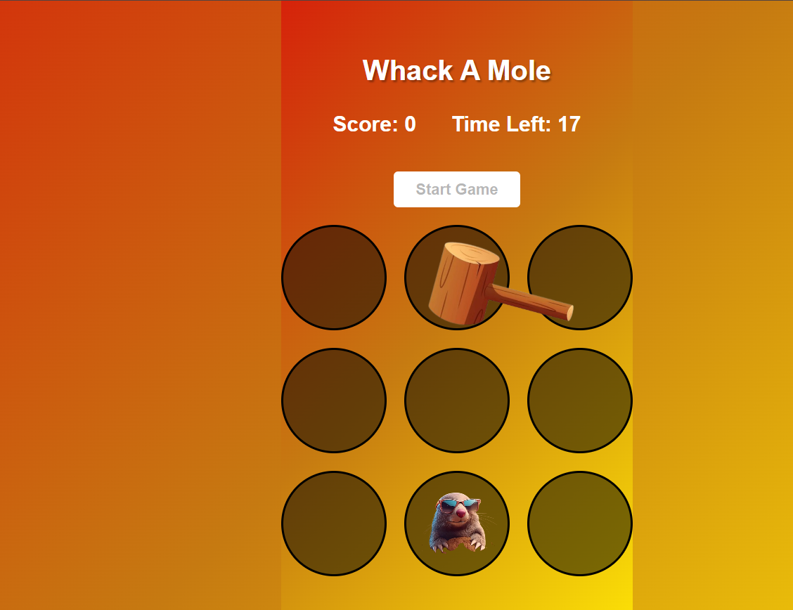

# 🎯 Whack-a-Mole Game

A fun browser-based Whack-a-Mole game built using HTML, CSS, and JavaScript.

## 🚀 Features

- Interactive gameplay
- Custom hammer cursor
- Sound effects on successful hits
- Score tracking system
- Countdown timer
- Random mole appearance
- Responsive design

## 🛠️ Technologies Used

- HTML5
- CSS3
- JavaScript (DOM Manipulation)

## 🎮 How to Play

1. Click the **Start Game** button.
2. Moles will randomly appear from holes.
3. Click the mole with the hammer to score points.
4. Try to get the highest score before the timer ends.

## 📂 Project Structure

project-folder/
│
├── index.html
├── style.css
├── script.js
├── sound.mp3
└── images/

## 📸 Screenshot

Add a screenshot here:

## 🔧 Installation

1. Clone the repository

git clone https://github.com/Kumud9/whack-a-mole.git

2. Open `index.html` in your browser.

## 🎯 Future Improvements

- Multiple difficulty levels
- High score storage using Local Storage
- Mobile support
- Different mole characters

## 👩‍💻 Author

Kumud Chouhan

LinkedIn: https://www.linkedin.com/in/kumud-chouhan-842402321/
GitHub: https://github.com/Kumud9